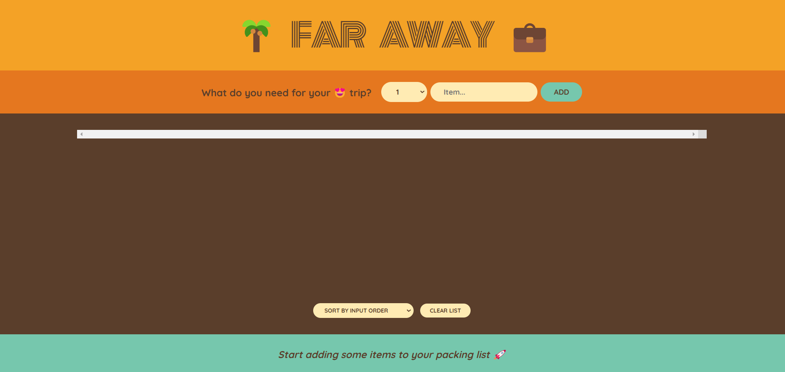
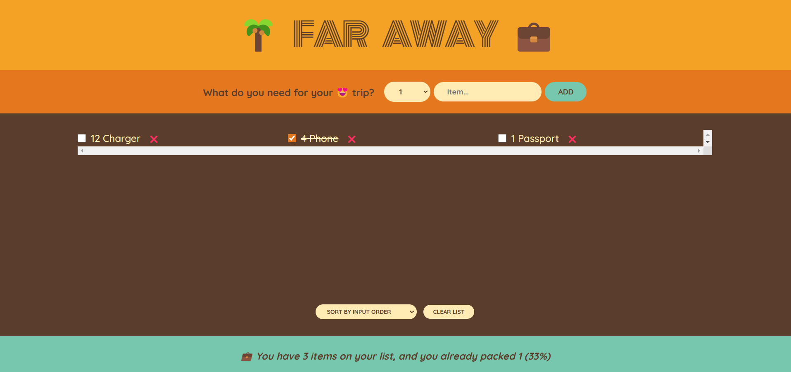

# 🌴 Far Away Packing List 💼

Far Away Packing List is an intuitive React application designed to help users manage and organize their travel essentials efficiently. With dynamic sorting, item status toggling, and list-clearing capabilities, this application simplifies packing for your trips. 

## Features

- **Add Items:** Seamlessly add items to your packing list with their description and quantity.
- **Toggle Packed Status:** Mark items as packed or unpacked with a single click.
- **Delete Items:** Remove unwanted items from the list.
- **Clear Entire List:** Clear all items with a confirmation prompt.
- **Sort Functionality:** Sort items by input order, description, or packing status.
- **Statistics:** View the total number of items, packed items, and the percentage of items packed.

## Component Tree

```
App
├── Logo
├── Form
├── PackingList
│   ├── Item
└── Stats
```

## Screenshots


*Adding items to the list.*


*Marked items as packed with dynamic stats.*

## Tech Stack

- **Frontend:** React
- **Styling:** CSS for responsive and user-friendly design

## Installation

1. Clone the repository:
   ```bash
   git clone https://github.com/TarkhanGurbanli/Far-Away.git
   ```
2. Navigate to the project directory:
   ```bash
   cd far-away
   ```
3. Install dependencies:
   ```bash
   npm install
   ```
4. Start the development server:
   ```bash
   npm start
   ```
5. Open your browser and go to `http://localhost:3000`.

## Folder Structure

```
far-away-packing-list
├── src
│   ├── components
│   │   ├── Form.jsx
│   │   ├── Item.jsx
│   │   ├── Logo.jsx
│   │   ├── PackingList.jsx
│   │   └── Stats.jsx
│   ├── App.jsx
│   └── index.css
├── public
│   ├── add-items.png
│   ├── packed-items.png
│   └── ...
├── package.json
├── README.md
└── index.html
```

## Usage

1. Launch the application using the steps in the installation section.
2. Use the form to add items with descriptions and quantities.
3. Toggle the packed status, delete specific items, or clear the entire list.
4. Check real-time statistics for your packing progress.

## License

This project is licensed under the MIT License. See the `LICENSE` file for more details.

## Contact

If you have any questions or suggestions about this project, feel free to reach out:

- **GitHub:** [TarkhanGurbanli](https://github.com/TarkhanGurbanli)
- **LinkedIn:** [TarkhanGurbanli](https://www.linkedin.com/in/tarkhan-gurbanli/)

## Contributing

Contributions are welcome! To contribute:

1. Fork the repository.
2. Create a feature branch:
   ```bash
   git checkout -b feature-name
   ```
3. Commit your changes:
   ```bash
   git commit -m "Add feature"
   ```
4. Push to your branch:
   ```bash
   git push origin feature-name
   ```
5. Open a pull request.

---

Enjoy organizing your travels with Far Away Packing List! 🌴💼
